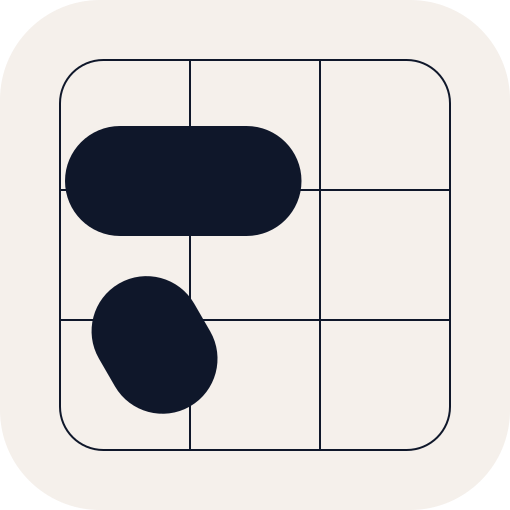

<div align="center">
  
  <h1>Term</h1>
  <p><strong>A blazingly fast, GPU-accelerated terminal emulator built with Odin and Metal/wgpu.</strong></p>

  [](https://github.com/dwlhm/term/actions/workflows/ci.yml)
  [](LICENSE)
  [](https://odin-lang.org)
  []()
</div>

---

## Overview & Philosophy

**Term** is a high-performance terminal emulator engineered from first principles in [Odin](https://odin-lang.org) on top of Metal/wgpu. Designed with a strict **measure-first engineering philosophy**, every optimization, data structure, and GPU pipeline stage is gated by empirical percentiles ($p_{50}, p_{95}, p_{99}, p_{99.9}$) rather than intuition.

The architecture follows the shortest path from PTY bytes to displayed pixels:

$$\text{PTY Bytes} \longrightarrow \text{Input Ring} \longrightarrow \text{VT State Machine} \longrightarrow \text{Ring Grid} \longrightarrow \text{Render Compiler} \longrightarrow \text{Adaptive GPU Strategy} \longrightarrow \text{Metal / wgpu Presentation}$$

### Core Invariants

1. **Steady-State Zero Allocations**: After initialization, normal frame cycles perform zero heap allocations. Input ring buffers, Extended Grapheme Cluster (EGC) pools ($256 \times 4$), shape cache ($1024$ entries), and GPU atlas slots ($512$ fixed-slot) are pre-allocated.
2. **Zero-Overhead ASCII Fast Path**: ASCII characters bypass UTF-8 decoding, multi-font fallback lookups, and complex shaping routines entirely.
3. **$\mathcal{O}(\text{changes})$ Work Complexity**: Strict hierarchical damage tracking (`cell` $\to$ `span` $\to$ `row`). Dirty uploads transmit only mutated cells ($288\text{ B}$ for a single cell vs. $184,320\text{ B}$ for full screen — a $\sim 1/640$ bandwidth reduction). Scrolling is $\mathcal{O}(1)$ via circular ring offsets without `memmove`.
4. **Idle Zero Work**: When no PTY events arrive and no damage is dirty, the renderer performs zero redraws, zero recompiles, and zero GPU uploads.

---

## Key Highlights

### ⚡ $\mathcal{O}(1)$ Ring-Buffer Scrollback & Scalar VT Parser
- **Flat Scrolling Latency**: Benchmark verified at $\sim 251\text{--}275\text{ ns}$ flat latency across $24 \to 192$ rows (latency ratio $< 1.5$) with zero memory copying (`memmove`).
- **Deterministic VT State Machine**: Powered by a compact $2\text{ KB}$ transition table delivering $\sim 39\text{ MB/s}$ scalar ASCII throughput and $3.4\text{M}$ CSI sequences per second.

### 🎮 Adaptive 3-Strategy GPU Rendering
Rather than forcing a single rendering method across varying terminal workloads, Term features an adaptive multi-strategy renderer evaluated per frame in **$35.9\text{ ns}$**:
- **Instance Strategy (2 Draws)**: Optimal for sparse text, single-cell cursor blinks, and interactive typing ($8\times$ faster than compute shaders during scrolling).
- **Compute Tile Strategy**: Divides the screen into compute workgroups, excelling at dense full-row terminal outputs ($3\times$ faster on dense text lines).
- **Fullscreen Strategy (`draw(3, 1)`)**: Single fullscreen triangle pass triggered on massive frame refreshes (crosses over at $\ge 25\%$ dirty vs. instance, and $100\%$ vs. compute).
- **Protected Carve-Outs**: Hard-coded heuristics ensure single-cell updates and scrolling paths never suffer regression from heavy GPU passes.

### 🔤 Comprehensive Unicode & Typography
- **Extended Grapheme Clusters (EGC)**: Complete support for combining characters, skin-tone modifiers, zero-width joiners (ZWJ), and wide CJK glyphs.
- **Multi-Tier Font Fallback**: Cascading fallback chain ($\le 4$ fonts) including **Maple Mono NF**, **Symbols Nerd Font Mono**, Arabic presentation forms, and Apple Color Emoji / Native Emoji Atlas.
- **Asynchronous Glyph Rasterization**: Mitigates cold-miss frame spikes from $37.16\text{ ms}$ down to $0.692\text{ ms}$ ($53.7\times$ speedup) using a background worker with blank-then-pop-in display.

### 📡 Modern Terminal Protocols
- **Kitty Keyboard Protocol**: Disambiguated escape codes, press/release event distinction, and modifier key reporting.
- **OSC 133 Shell Integration**: Complete prompt marking (`133;A`), command execution boundaries (`133;B`), command finished notifications (`133;D`), and scrollback preservation.
- **Synchronized Output (`CSI ? 2026 h / l`)**: Atomic buffer swaps that eliminate screen tearing during high-frequency redraws (e.g. `htop`, `neovim`).
- **Bracketed Paste Mode (`CSI ? 2004 h / l`)**: Safe terminal paste operations preventing accidental command execution.

### 🍎 Native macOS Integration
- Robust POSIX pseudo-terminal lifecycle (`posix_openpt`, non-blocking drains, `TIOCSWINSZ` window size propagation, and zombie process cleanup).
- Low-latency native Cocoa window event loop with macOS accent press-and-hold key repeat handling.

---

## Benchmarks & Verification

All architectural decisions are documented with empirical benchmarks in [LAPORAN.md](file:///Users/dwlhm/project/term/LAPORAN.md). Key findings include:

| Metric / Component | Measured Result | Architectural Decision |
|---|---|---|
| **ASCII Parser Throughput** | $\sim 39\text{ MB/s}$ | Scalar transition table kept (SIMD discarded: geomean $0.68 < 1.15$ on real mixes) |
| **CSI Sequence Throughput** | $3.4\text{M}\text{ seq/s}$ | Compact $2\text{ KB}$ L1-cache friendly table |
| **Grid Scroll ($24 \to 192$ rows)** | $251\text{--}275\text{ ns}$ | $\mathcal{O}(1)$ ring buffer; verified zero `memmove` |
| **Dirty Upload (1 cell vs Full)** | $288\text{ B}$ vs $184,320\text{ B}$ | $1/640$ bandwidth ratio |
| **Async Glyph Storm Miss** | $37.16\text{ ms} \to 0.692\text{ ms}$ | $53.7\times$ speedup via 1 worker thread |
| **Adaptive Strategy Overhead** | $35.9\text{ ns}$ per frame | Negligible CPU cost for optimal GPU selection |
| **WGPU vtable Overhead** | $46\text{ ns}$ / frame ($0.0003\%$) | wgpu/Metal retained over complex native Vulkan |
| **SDF / MSDF Glyph Rendering** | $5/6$ quality gates failed | Discarded in favor of crisp bitmap atlas |

---

## Getting Started

### Prerequisites
- **macOS**: macOS 11.0 (Big Sur) or newer (Apple Silicon M1/M2/M3/M4 or Intel).
- **Odin Compiler**: `dev-2026-08` or newer installed in your `PATH`.
- **Make**: Standard POSIX `make` tool.

### Building & Running

```bash
# 1. Clone the repository
git clone https://github.com/dwlhm/term.git
cd term

# 2. Ensure WGPU native library is installed (downloads prebuilt binary if missing from Odin vendor)
make setup-wgpu

# 3. Build debug executable (bin/term)
make build

# 4. Build optimized release binary
make release

# 5. Build macOS application bundle (bin/Term.app)
make bundle

# 6. Launch Term
make run
# or launch the native bundle:
open bin/Term.app
```

### Running Tests & Quality Checks

```bash
# Type check all packages
make check

# Run all test suites (terminal, parser, pty, input, render, app, bench)
make test
```

### Compiling & Running Benchmarks

```bash
# Compile benchmark tools
make bench

# Execute benchmark suites
./bin/bench_terminal
./bin/bench_parser
./bin/bench_pty
./bin/bench_input_photon
```

---

## Directory Structure

```
term/
├── assets/                  # Icons (icns, png, ico), Info.plist, fonts, and .desktop
│   ├── Info.plist           # macOS bundle metadata
│   ├── term.icns            # Multi-resolution macOS iconset
│   ├── term.png             # 512x512 application icon
│   ├── term.ico             # Windows multi-resolution icon
│   ├── term.desktop         # Linux FreeDesktop entry
│   └── fonts/               # Embedded Maple Mono and Nerd Font assets
├── bin/                     # Output binaries (term, Term.app, benchmarks)
├── docs/                    # Architectural notes & research records
├── src/
│   ├── app/                 # Main application loop, Cocoa/SDL integration
│   ├── bench/               # Benchmark harness, trace replay, statistics
│   ├── parser/              # VT state machine, UTF-8 parser, CSI handlers
│   ├── platform/            # PTY lifecycle, keyboard/mouse input, windowing
│   ├── render/              # Atlas, compiler, adaptive strategies (Instance, Tile, Fullscreen)
│   └── terminal/            # O(1) ring grid, grapheme segmentation, damage hierarchy
├── LAPORAN.md               # Comprehensive 21-phase engineering report & benchmarks
├── Makefile                 # Build, test, release, bundle, and benchmark automation
├── LICENSE                  # MIT License
└── logo.svg                 # Vector source logo
```

---

## License

This project is licensed under the [MIT License](LICENSE) — Copyright (c) 2026 dwlhm.
