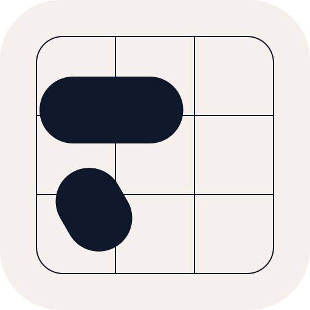

<div align="center">
  
  <h1>Term</h1>
  <p><strong>A blazingly fast, GPU-accelerated terminal emulator built with Odin, Native Apple Metal and Standalone Headless MCP Server.</strong></p>

  [](https://github.com/dwlhm/term/actions/workflows/ci.yml)
  [](LICENSE)
  [](https://odin-lang.org)
  []()
</div>

---

## Overview & Philosophy

**Term** is a high-performance terminal emulator engineered from first principles in [Odin](https://odin-lang.org) on top of Native Apple Metal (`CAMetalLayer`). Designed with a strict **measure-first engineering philosophy**, every optimization, data structure, and GPU pipeline stage is gated by empirical percentiles ($p_{50}, p_{95}, p_{99}, p_{99.9}$) rather than intuition.

The architecture follows the shortest path from PTY bytes to displayed pixels:

$$\text{PTY Bytes} \longrightarrow \text{Input Ring} \longrightarrow \text{VT State Machine} \longrightarrow \text{Ring Grid} \longrightarrow \text{Render Compiler} \longrightarrow \text{Adaptive GPU Strategy} \longrightarrow \text{Native Apple Metal Presentation}$$

### Core Invariants

1. **Steady-State Zero Allocations**: After initialization, normal frame cycles perform zero heap allocations. Input ring buffers, Extended Grapheme Cluster (EGC) pools ($256 \times 4$), shape cache ($1024$ entries), and GPU atlas slots ($512$ fixed-slot) are pre-allocated.
2. **Zero-Overhead ASCII Fast Path**: ASCII characters bypass UTF-8 decoding, multi-font fallback lookups, and complex shaping routines entirely.
3. **$\mathcal{O}(\text{changes})$ Work Complexity**: Strict hierarchical damage tracking (`cell` $\to$ `span` $\to$ `row`). Dirty uploads transmit only mutated cells ($288\text{ B}$ for a single cell vs. $184,320\text{ B}$ for full screen — a $\sim 1/640$ bandwidth reduction). Scrolling is $\mathcal{O}(1)$ via circular ring offsets without `memmove`.
4. **Idle Zero Work**: When no PTY events arrive and no damage is dirty, the renderer performs zero redraws, zero recompiles, and zero GPU uploads.

---

## Key Highlights

### ⚡ $\mathcal{O}(1)$ Ring-Buffer Scrollback & Scalar VT Parser
- **Flat Scrolling Latency**: Benchmark verified at $\sim 251\text{--}275\text{ ns}$ flat latency across $24 \to 192$ rows (latency ratio $< 1.5$) with zero memory copying (`memmove`).
- **Deterministic VT State Machine**: Powered by a compact $2\text{ KB}$ transition table delivering $\sim 39\text{ MB/s}$ scalar ASCII throughput and $3.4\text{M}$ CSI sequences per second.

### 🎮 Adaptive 3-Strategy GPU Rendering
Rather than forcing a single rendering method across varying terminal workloads, Term features an adaptive multi-strategy renderer evaluated per frame in **$35.9\text{ ns}$**:
- **Instance Strategy (2 Draws)**: Optimal for sparse text, single-cell cursor blinks, and interactive typing ($8\times$ faster than compute shaders during scrolling).
- **Compute Tile Strategy**: Divides the screen into compute workgroups, excelling at dense full-row terminal outputs ($3\times$ faster on dense text lines).
- **Fullscreen Strategy (`draw(3, 1)`)**: Single fullscreen triangle pass triggered on massive frame refreshes (crosses over at $\ge 25\%$ dirty vs. instance, and $100\%$ vs. compute).
- **Protected Carve-Outs**: Hard-coded heuristics ensure single-cell updates and scrolling paths never suffer regression from heavy GPU passes.

### 🔤 Comprehensive Unicode & Typography
- **Extended Grapheme Clusters (EGC)**: Complete support for combining characters, skin-tone modifiers, zero-width joiners (ZWJ), and wide CJK glyphs.
- **Multi-Tier Font Fallback**: Cascading fallback chain ($\le 4$ fonts) including **Maple Mono NF**, **Symbols Nerd Font Mono**, Arabic presentation forms, and Apple Color Emoji / Native Emoji Atlas.
- **Asynchronous Glyph Rasterization**: Mitigates cold-miss frame spikes from $37.16\text{ ms}$ down to $0.692\text{ ms}$ ($53.7\times$ speedup) using a background worker with blank-then-pop-in display.

### 📡 Modern Terminal Protocols
- **Kitty Keyboard Protocol**: Disambiguated escape codes, press/release event distinction, and modifier key reporting.
- **OSC 133 Shell Integration**: Complete prompt marking (`133;A`), command execution boundaries (`133;B`), command finished notifications (`133;D`), and scrollback preservation.
- **Synchronized Output (`CSI ? 2026 h / l`)**: Atomic buffer swaps that eliminate screen tearing during high-frequency redraws (e.g. `htop`, `neovim`).
- **Bracketed Paste Mode (`CSI ? 2004 h / l`)**: Safe terminal paste operations preventing accidental command execution.

### 🍎 Native macOS Integration
- Robust POSIX pseudo-terminal lifecycle (`posix_openpt`, non-blocking drains, `TIOCSWINSZ` window size propagation, and zombie process cleanup).
- Low-latency native Cocoa window event loop with macOS accent press-and-hold key repeat handling.

### 📑 Native Multi-Tab UI & Interactive Selection (v0.2.0)
- **Multi-Tab Sessions**: Concurrent independent terminal sessions with isolated PTY lifecycles, tab bar chrome, tab switching (`Cmd+1`..`Cmd+9`, `Cmd+Shift+[` / `]`), and non-blocking in-terminal search overlay (`Cmd+F`).
- **Interactive Mouse Selection & URLs**: Linear, word, line, and rectangular block selection rendered via a zero-cost Metal overlay pipeline, with OSC 8 hyperlink detection and `Cmd+Click` opening.

### 🤖 Standalone Headless Model Context Protocol (MCP) Server (`term-mcp`)
Term includes a dedicated, standalone headless Model Context Protocol ([MCP](https://modelcontextprotocol.io)) server binary (`bin/term-mcp`) designed for AI coding agents and autonomous workflows. It provides native, ultra-low latency terminal session control without X11, Cocoa, or GPU window dependencies:
- **7 MECE Core Automation Tools**:
  - `terminal_create_session`: Spawns an isolated pseudo-terminal (PTY) session with configurable dimensions (`rows`, `cols`), working directory (`cwd`), shell executable (`shell`), and execution profile (`mode`).
  - `terminal_close_session`: Closes an active terminal session, terminates its child process tree cleanly via process group signalling (`killpg`), and reclaims all virtual grid resources.
  - `terminal_run_command`: Executes shell commands synchronously with deterministic dual-completion detection and exit code extraction, returning clean output without ANSI escape bloat.
  - `terminal_send_input`: Writes raw text or characters directly into the session's PTY stdin.
  - `terminal_send_key`: Emits special control keys and escape sequences (`Enter`, `Tab`, `Backspace`, `Escape`, `Ctrl+C`, `Ctrl+D`, `Ctrl+Z`, arrow navigation).
  - `terminal_get_screen`: Captures a clean, 2D visual viewport snapshot from the virtual terminal grid with optional scrollback lines, stripping cursor position artifacts.
  - `terminal_resize`: Dynamically resizes the virtual terminal grid and propagates `TIOCSWINSZ` / `SIGWINCH` window size change signals to active subprocesses.
- **Hexagonal Architecture (`src/session_core`)**:
  - Decoupled ports ([`Terminal_Control_Port`](file:///Users/dwlhm/project/term/src/session_core/ports.odin) & [`Terminal_Observer_Port`](file:///Users/dwlhm/project/term/src/session_core/ports.odin#L11-L17)) isolate core terminal logic from presentation frontends.
  - **`Fast_Headless` Mode (Default)**: Strips interactive shell decoration, eliminates ZLE/precmd prompt latency, and executes commands with near-zero latency (**0.27 ms**) and massive stream throughput (**>80 MB/s**). Preserves the user's complete `$PATH` and environment with zero prompt baggage.
  - **`Interactive_GUI` Mode**: Full interactive shell session with standard dotfile evaluation (`.zshrc`), line-editing, and live rendering across native Apple Metal viewports.
- **Unrivaled Efficiency vs Node.js & Python**:
  - **Command Latency**: **0.27 ms** ($p_{50}$) — **105× faster** than Node.js (`node-pty` + `xterm-headless` at 28.5 ms).
  - **Physical RSS Memory**: **1.92 MB** (1 active session) — **44× lower** than Node.js (84.5 MB).
  - **Output Verification**: **100% assertion pass rate** (103/103 assertions across 11 suites, 0.0% error rate).

---

## Documentation

Term provides a modular documentation suite detailing installation, architecture, daily usage, declarative configuration, headless MCP automation, and empirical benchmarks:

| Document | Description | Target Audience |
|---|---|---|
| **[Documentation Index](docs/README.md)** | Master documentation index, architectural invariants, and documentation map. | All users & contributors |
| **[Getting Started](docs/getting-started.md)** | Installation, prerequisites, building debug/release binaries, macOS app bundling, DMG creation, and test suites. | New users & builders |
| **[User Guide](docs/user-guide.md)** | Daily workflows, keyboard shortcuts, multi-tab lifecycle, session switcher modal, selection models, and search overlay. | End users |
| **[Configuration Guide](docs/configuration.md)** | Declarative Odin AST configuration format, full options reference, color palettes, and custom keybindings. | Power users & customizers |
| **[Architecture Specification](docs/architecture.md)** | System architecture, hexagonal core, Ports and Adapters, PTY lifecycle, scalar VT parser, 32-bit ARGB TrueColor, and Metal renderer. | Systems engineers |
| **[MCP Server Specification](docs/mcp-server.md)** | Standalone headless MCP server guide, JSON-RPC 2.0 stdio protocol, 7 MECE automation tools, and AI agent integration. | AI tool builders & integrators |
| **[Benchmark Report](docs/benchmarks.md)** | Empirical microbenchmarks, comparative evaluations (Term vs. Alacritty vs. Ghostty), video telemetry, and MCP latency tests. | Performance evaluators |
| **[Developer Guide](docs/developer-guide.md)** | Contributing guidelines, coding conventions, architectural invariants, diagnostic probes, profiling, and test workflows. | Contributors & developers |

---

## Benchmarks & Verification

All architectural decisions are documented with empirical benchmarks in [LAPORAN.md](file:///Users/dwlhm/project/term/LAPORAN.md), external comparative throughput and latency evaluations against Alacritty and Ghostty in [COMPARATIVE_BENCHMARKS.md](file:///Users/dwlhm/project/term/COMPARATIVE_BENCHMARKS.md), and comprehensive headless agent server evaluations in [MCP_BENCHMARKS.md](file:///Users/dwlhm/project/term/MCP_BENCHMARKS.md). Key findings include:

| Metric / Component | Measured Result | Architectural Decision |
|---|---|---|
| **ASCII Parser Throughput** | $\sim 39\text{ MB/s}$ | Scalar transition table kept (SIMD discarded: geomean $0.68 < 1.15$ on real mixes) |
| **CSI Sequence Throughput** | $3.4\text{M}\text{ seq/s}$ | Compact $2\text{ KB}$ L1-cache friendly table |
| **Grid Scroll ($24 \to 192$ rows)** | $251\text{--}275\text{ ns}$ | $\mathcal{O}(1)$ ring buffer; verified zero `memmove` |
| **Dirty Upload (1 cell vs Full)** | $288\text{ B}$ vs $184,320\text{ B}$ | $1/640$ bandwidth ratio |
| **Async Glyph Storm Miss** | $37.16\text{ ms} \to 0.692\text{ ms}$ | $53.7\times$ speedup via 1 worker thread |
| **Adaptive Strategy Overhead** | $35.9\text{ ns}$ per frame | Negligible CPU cost for optimal GPU selection |
| **WGPU vtable Overhead** | $46\text{ ns}$ / frame ($0.0003\%$) | wgpu/Metal retained over complex native Vulkan |
| **SDF / MSDF Glyph Rendering** | $5/6$ quality gates failed | Discarded in favor of crisp bitmap atlas |
| **MCP Command Latency ($p_{50}$)** | $0.27\text{ ms}$ | $105\times$ faster than Node.js; deterministic dual-completion detection |
| **MCP RSS Memory (1 session)** | $1.92\text{ MB}$ | $44\times$ lower than Node.js; zero-dependency native Mach-O binary |

---

## Getting Started

### Installation

#### macOS
Download the latest prebuilt release from [GitHub Releases](https://github.com/dwlhm/term/releases):
- **Disk Image (`.dmg`)**: Download `Term.dmg`, open it, and drag `Term.app` into `/Applications`.
- **Archive (`.tar.gz` / `.zip`)**: Download `term-macos-arm64.tar.gz` or `term-macos-arm64.zip`, extract, and move `Term.app` to `/Applications`.
- **Headless MCP Server**: Download `term-mcp-macos-arm64.tar.gz` and extract `term-mcp` into your `$PATH`.

#### Linux
Download the latest Linux tarball from [GitHub Releases](https://github.com/dwlhm/term/releases):
```bash
# Download the latest Linux tarball from GitHub Releases:
tar -xzf term-v0.4.1-linux-x86_64.tar.gz
cd term-v0.4.1-linux-x86_64
sudo ./install.sh
# (Or install to user directory: ./install.sh --prefix ~/.local)
```
- **Headless MCP Server**: Download `term-mcp-linux-x86_64.tar.gz` and extract `term-mcp` into your `$PATH`.

### Building from Source

#### Prerequisites
- **Odin Compiler**: `dev-2026-08` or newer installed in your `PATH`.
- **Make**: Standard POSIX `make` tool.
- **macOS Dependencies**:
  - macOS 11.0 (Big Sur) or newer (Apple Silicon or Intel).
  - Install dependencies via Homebrew:
    ```bash
    brew install sdl3 freetype harfbuzz
    ```
- **Linux Dependencies**:
  - **Ubuntu / Debian**:
    ```bash
    sudo apt-get update
    sudo apt-get install -y ninja-build libasound2-dev libpulse-dev libx11-dev libxext-dev \
      libxrandr-dev libxcursor-dev libxfixes-dev libxi-dev libxss-dev libxkbcommon-dev \
      libdrm-dev libgbm-dev libgl1-mesa-dev libegl1-mesa-dev libwayland-dev libdecor-0-dev \
      libfreetype-dev libharfbuzz-dev libvulkan-dev
    ```
  - **Arch Linux**:
    ```bash
    sudo pacman -S sdl3 freetype2 harfbuzz vulkan-devel
    ```
  - **Fedora**:
    ```bash
    sudo dnf install SDL3-devel freetype-devel harfbuzz-devel vulkan-loader-devel
    ```
  - *Note*: If SDL3 is not packaged in your Linux distribution repository, build and install SDL 3.2.8+ from source.

#### Building Commands

```bash
# 1. Clone the repository
git clone https://github.com/dwlhm/term.git
cd term

# 2. Build debug executable (bin/term)
make build

# 3. Build optimized release binary
make release

# 4. Launch Term
make run

# 5. Install system-wide (macOS: /Applications/Term.app; Linux: /usr/local/bin & /usr/local/share)
sudo make install

# 6. Package standalone Linux distribution tarball (Linux)
make dist-linux

# 7. Build macOS application bundle & DMG (macOS)
make bundle
make dmg

# 8. Build standalone headless MCP server
make build-mcp
make release-mcp
```

> [!NOTE]
> **macOS Gatekeeper & Ad-Hoc Signing**:
> Standalone open-source bundles on macOS use ad-hoc codesigning. If macOS displays an "unidentified developer" prompt upon opening `Term.app` from an installer or DMG, right-click `Term.app` and choose **Open**, or remove quarantine attributes:
> ```bash
> xattr -d com.apple.quarantine /Applications/Term.app
> ```

### Running Tests & Quality Checks

```bash
# Type check all packages
make check

# Run all test suites (terminal, parser, pty, input, render, app, bench)
make test

# Run Odin MCP unit tests
make test-mcp
```

### Compiling & Running Benchmarks

```bash
# Compile benchmark tools
make bench

# Execute benchmark suites
./bin/bench_terminal
./bin/bench_parser
./bin/bench_pty
./bin/bench_input_photon

# Run comprehensive 11-suite MCP benchmark
make bench-mcp
```

---

## Directory Structure

```
term/
├── assets/                  # Icons (icns, png, ico), Info.plist, fonts, and entitlements
│   ├── Info.plist           # macOS bundle metadata
│   ├── Term.entitlements    # macOS hardened runtime ad-hoc entitlements
│   ├── term.icns            # Multi-resolution macOS iconset
│   ├── term.png             # 512x512 application icon
│   ├── term.ico             # Windows multi-resolution icon
│   ├── term.desktop         # Linux FreeDesktop entry
│   └── fonts/               # Embedded fonts and SIL OFL licenses
│       ├── MapleMono-NF-Regular.ttf
│       ├── SymbolsNerdFontMono-Regular.ttf
│       ├── OFL-MapleMono.txt
│       └── OFL-SymbolsNerdFont.txt
├── bin/                     # Output binaries (term, Term.app, term-mcp, benchmarks)
├── docs/                    # Modular documentation suite (Architecture, User Guide, Config, MCP, Benchmarks)
├── scripts/                 # Packaging, comparative benchmark suites, and utility scripts
│   └── bundle_frameworks.sh # Standalone dylib relocation and codesigning automation
├── src/
│   ├── app/                 # Main application loop, Cocoa/SDL integration
│   ├── bench/               # Benchmark harness, trace replay, statistics
│   ├── cmd/                 # Standalone binary entry points (term-mcp)
│   ├── config/              # Declarative configuration, themes, and keybindings
│   ├── interaction/         # Mouse selection, URL detection, clipboard actions
│   ├── parser/              # VT state machine, UTF-8 parser, CSI handlers
│   ├── platform/            # PTY lifecycle, keyboard/mouse input, windowing
│   ├── render/              # Atlas, compiler, adaptive strategies (Instance, Tile, Fullscreen)
│   ├── session_core/        # Hexagonal core session, ports, and execution modes
│   ├── terminal/            # O(1) ring grid, grapheme segmentation, damage hierarchy
│   └── ui/                  # Native tab bar, search overlay, modal dialogs, and chrome
├── COMPARATIVE_BENCHMARKS.md # Empirical head-to-head benchmarks (Term vs. Alacritty vs. Ghostty)
├── LAPORAN.md               # Comprehensive 21-phase engineering report & benchmarks
├── MCP_BENCHMARKS.md        # Performance benchmark report for term-mcp against Node/Python
├── Makefile                 # Build, test, release, bundle, and benchmark automation
├── RELEASE_NOTES.md         # Release history and feature notes (v0.3.0)
├── LICENSE                  # MIT License
├── THIRD_PARTY_NOTICES.md   # Third-party font, library, and dependency licenses
└── logo.svg                 # Vector source logo
```

---

## License

This project is licensed under the [MIT License](LICENSE) — Copyright (c) 2026 dwlhm.

Comprehensive copyright notices and licenses for bundled fonts, third-party libraries (FreeType, HarfBuzz, SDL3, libpng, Graphite2, GLib, gettext/libintl, PCRE2), and dependencies are detailed in [THIRD_PARTY_NOTICES.md](THIRD_PARTY_NOTICES.md).

