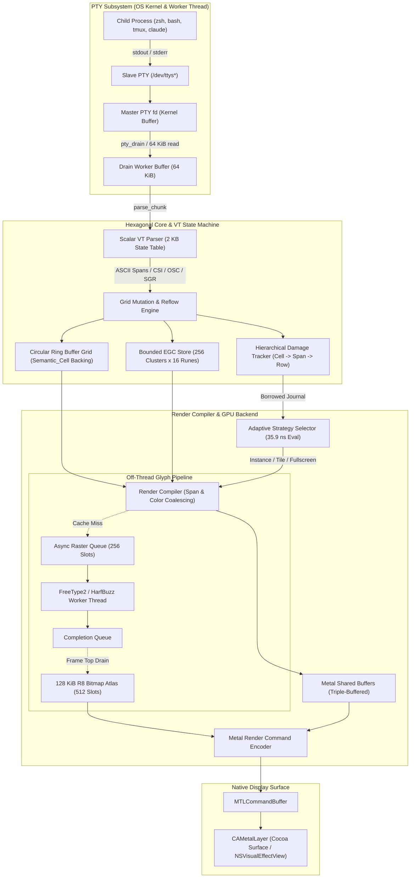
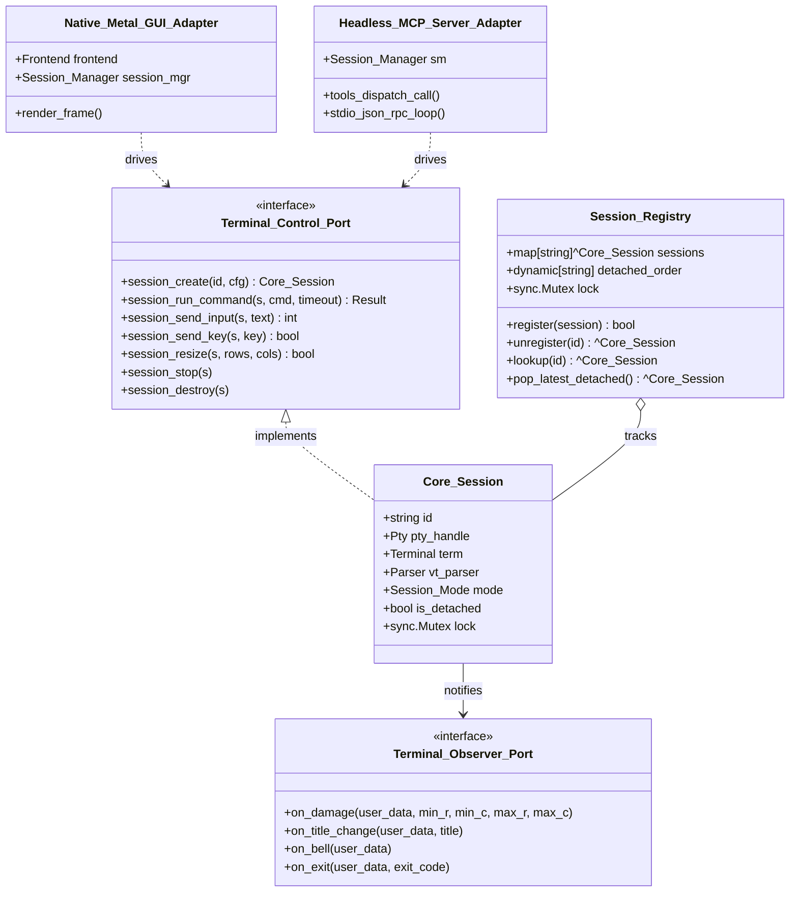
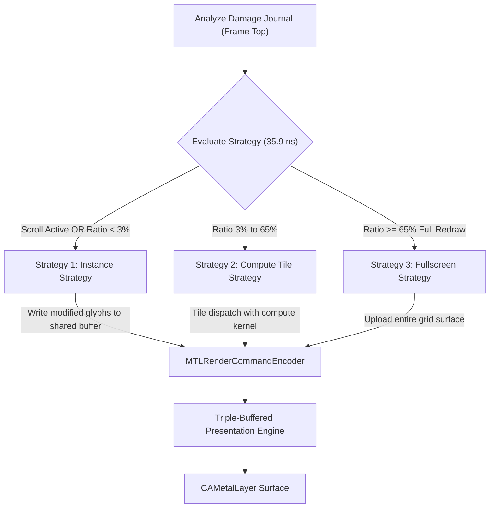

# Term Architecture & System Design

Term is a modern terminal emulator engineered from first principles in [Odin](https://odin-lang.org). Designed specifically for Apple Silicon and modern Unix environments, Term combines a bare-metal scalar VT parser, an allocation-free circular ring buffer grid, an asynchronous glyph pipeline, and an adaptive 3-strategy Apple Metal (`CAMetalLayer`) GPU renderer. Term also powers a native, zero-dependency Model Context Protocol (MCP) server for autonomous AI coding agents.

This document details the internal architecture, memory models, rendering pipelines, dataflow invariants, and platform integrations that govern Term's execution.

---

## 1. High-Level Dataflow Architecture

Term decouples terminal emulation into isolated pipelines: PTY I/O ingestion, scalar VT state parsing, virtual grid mutation, damage accounting, render command compilation, and hardware GPU execution.



### End-to-End Pipeline Stages

1. **PTY Ingestion**: The background drain thread polls the master PTY file descriptor using `select(2)` / `pselect(2)` with a 5 ms timeout slice. Bytes are drained in bulk into a contiguous 64 KiB buffer (`drain_buf`).
2. **VT Stream Classification & Parsing**: Raw bytes stream directly into the scalar VT parser (`src/parser/parser.odin`). The parser drives a 2 KB L1-resident transition table, slicing printable ASCII into bulk contiguous spans and dispatching ANSI escape codes (CSI, OSC, SGR).
3. **Ring Buffer Grid Mutation**: Text spans and control commands update the active `Grid` (`src/terminal/grid.odin`). Characters are committed as 8-byte `Semantic_Cell` values. If 24-bit TrueColor is present, direct ARGB channels are populated in `Row_Extensions`.
4. **Hierarchical Damage Accounting**: Every mutation tags the `Damage` journal (`src/terminal/damage.odin`). Damage accumulates from cell coordinate ranges into contiguous `Span` records (up to 4 spans per row) and escalates to full-row flags when necessary.
5. **Adaptive Render Compilation**: The render compiler (`src/render/compiler.odin`) samples the borrowed damage journal. Within **35.9 ns**, the strategy selector evaluates dirty ratios, scroll offsets, and submit timings to choose between **Instance**, **Compute Tile**, or **Fullscreen** GPU dispatch.
6. **Metal GPU Execution**: Vertex quads, background instances, and glyph texture coordinates are committed into Apple Silicon shared memory (`MTLStorageModeShared`). The GPU executes compiled Metal Shading Language (MSL) pipelines and presents jitter-free 60/120 FPS frames via `CAMetalLayer`.

---

## 2. Core Invariants & Memory Model

Term adheres to strict mechanical sympathy and zero-overhead performance guidelines across all operational loops.

```
+-------------------------------------------------------------------------+
|                         CORE SYSTEM INVARIANTS                          |
+------------------------------------+------------------------------------+
| 1. Steady-State Zero Allocations   | 2. Zero-Overhead ASCII Fast Path   |
| Preallocated rings, bounded pools  | Direct byte-to-cell transfer       |
| No malloc/free in render/PTY loop  | Bypasses UTF-8 and HarfBuzz        |
+------------------------------------+------------------------------------+
| 3. O(changes) Work Complexity      | 4. Idle Zero Work                  |
| Hierarchical cell->span->row damage| 0 redraws, 0 recompiles, 0 GPU     |
| 288 B single cell vs 184 KB full   | uploads when terminal is static    |
+------------------------------------+------------------------------------+
```

### 2.1 Steady-State Zero Allocations

Heap allocations are strictly prohibited inside the hot PTY draining, VT parsing, damage tracking, and rendering loops. All buffers and structures are preallocated at initialization or window resize:
- **PTY Ingestion Ring**: Contiguous 64 KiB fixed array per session.
- **Terminal Grid**: Backed by a single contiguous slice of `Semantic_Cell` structs and an accompanying parallel slice of `Direct_Color_Channel` structs sized to `capacity * cols`.
- **Extended Grapheme Cluster (EGC) Store**: Preallocated pool of 256 cluster records, each accommodating up to 16 Unicode codepoints (`GRAPHEME_INLINE_CAP = 16`). Managed via an inline LIFO free stack with zero dynamic reallocations.
- **Glyph Shape Cache**: Two-tier fixed open-addressing hash table with 1,024 entries.
- **GPU Glyph Atlas**: Single 128 KiB R8 texture (256x512 pixels) containing exactly 512 fixed slots (16x16 pixels per slot).
- **Damage Journal**: Double-buffered, reusable dirty row slices with zero per-frame allocation.

### 2.2 Zero-Overhead ASCII Fast Path

Because over 95% of standard terminal workloads consist of 7-bit ASCII characters (0x20..=0x7E), Term isolates ASCII processing from complex text layout (CTL) and font fallback machinery:
- When a byte is in the range `0x20..=0x7E`, the parser executes a single branch, writes the byte directly into the row's `Semantic_Cell` buffer, increments the cursor column, and updates row damage.
- The ASCII fast path completely bypasses UTF-8 decoding state machines, unicode grapheme boundary lookups, HarfBuzz complex shaping, and fallback font probing.
- Monospace font metrics ensure predictable 1:1 cell alignment, allowing direct index lookups in the primary glyph atlas.

### 2.3 $O(\text{changes})$ Work Complexity

Work performed per frame is proportional exclusively to the surface area of modified cells, not total screen size:
- **Hierarchical Damage**: Mutations propagate through a 3-tier hierarchy:
  1. `Cell`: Individual column mutations within a row.
  2. `Span`: Contiguous dirty ranges coalesced into fixed arrays (`DIRTY_ROW_MAX_SPANS = 4`).
  3. `Row`: Rows with more than 4 non-contiguous spans or full row operations degrade to full-row dirty records.
- **Flat Scroll Latency (251-275 ns)**: Scrolling operations never execute `memmove` or `memcpy` across the grid. The grid shifts its internal physical origin pointer via fast bitwise masking:
  $$\text{origin} = (\text{origin} + \text{scrolled\_rows}) \ \& \ \text{mask}$$
  Moving millions of cells requires under 275 nanoseconds regardless of viewport dimension.
- **Dirty GPU Uploads**: Dirty rows transmit only active spans to the GPU instance buffer. A single-cell modification (such as cursor typing) uploads **288 bytes** of instance data, compared to **184 KiB** required for an unoptimized full-screen redraw.

```
Single-Cell Edit (Typing):  [ 288 B Instance Upload ]
Full-Screen Redraw:         [=========================== 184 KiB ===========================]
```

### 2.4 Idle Zero Work

When no child process output is received and the cursor is steady:
- The PTY drain thread sleeps in `pselect(2)` with zero CPU utilization.
- The UI main loop skips frame staging and GPU submission completely.
- Frame pacing drops to 0 redraws, 0 shader evaluations, and 0 GPU command encoder dispatches.

---

## 3. Hexagonal Session Core & `Session_Registry`

The session architecture follows a strict **Hexagonal (Ports and Adapters)** pattern (`src/session_core/`), completely decoupling terminal state management from the rendering frontend and external RPC interfaces.



### 3.1 Ports and Adapters

1. **`Terminal_Control_Port`**: The primary driving port. Exposes lifecycle controls, synchronous command execution, raw stdin byte delivery, standardized control key sequences, and window resizing.
2. **`Terminal_Observer_Port`**: The secondary driven port. Defines callback hooks invoked by the session's background drain pump:
   - `on_damage(user_data, min_row, min_col, max_row, max_col)`: Signals dirty cell boundaries to trigger GUI presentation.
   - `on_title_change(user_data, title)`: Propagates OSC 0/2 window titles.
   - `on_bell(user_data)`: Propagates visual or auditory bell triggers.
   - `on_exit(user_data, exit_code)`: Signals subprocess termination.

### 3.2 Primary Adapters

- **Native Metal GUI Adapter (`src/app/`)**: Integrates SDL3 window management, Apple Metal swapchains, keyboard/mouse event dispatch, and multi-tab rendering.
- **Headless MCP Server Adapter (`src/cmd/term_mcp/`)**: A dedicated command-line binary communicating via standard I/O using JSON-RPC 2.0. Exposes terminal state to AI agent runtimes without linking Metal, Cocoa, or SDL3.

### 3.3 Session Execution Modes

`Core_Session` operates in two distinct operational modes:

| Mode | Target Use Case | Latency ($p_{50}$) | Throughput | Shell Invocation | Startup Initialization |
|---|---|---|---|---|---|
| **`Fast_Headless`** | AI Agents, automated scripts, CI/CD | **0.27 ms** | **>80 MB/s** | `--no-rcs` (zsh) / `--norc --noprofile` (bash) | Disables ZLE/echo, clears prompts, skips dotfiles |
| **`Interactive_GUI`** | Human developer desktop workflow | ~1.20 ms | >65 MB/s | `-l` (Login shell) | Full `.zshrc`/`.bashrc` execution, ZLE, syntax highlighting |

In `Fast_Headless` mode, Term injects an optimized bootstrap preamble:
```sh
stty -echo 2>/dev/null; export PROMPT='' RPROMPT='' PS1=''; precmd_functions=(); chpwd_functions=(); precmd() {}; unsetopt zle 2>/dev/null
```
This strips away prompt decoration, echo pollution, and line editor overhead, allowing agent commands to execute with near-native process latency.

### 3.4 Zero-Copy Session Detachment & Memory Transfer

Term supports detaching live terminal sessions from GUI tabs into headless background sessions, or vice-versa, with **zero memory copies**:
1. **Thread Suspension**: The GUI tab halts its rendering worker thread.
2. **Handle Extraction**: The underlying PTY master descriptor (`pty_handle`), terminal grid (`term`), and parser state (`vt_parser`) are extracted directly from the GUI `Tab_Session`.
3. **Handle Invalidation**: Pointers in the source GUI backend are set to `nil` and `-1`, preventing the GUI teardown routines from closing the kernel PTY descriptor or freeing memory allocations.
4. **Adoption**: The extracted state is moved directly into a new `Core_Session` registered with `Session_Registry`.
5. **Background Draining**: The session continues running background PTY reading without interrupting child processes or sending `SIGHUP`.

The global `Session_Registry` (`session_registry_default()`) maintains thread-safe tracking of all active and detached sessions, allowing detached sessions to be re-attached to newly spawned GUI tabs seamlessly.

---

## 4. Deterministic VT Parser & Color Subsystem

Term features a scalar VT parser (`src/parser/`) engineered for deterministic execution and maximum memory safety.

```
VT Parser Byte Ingestion:
[ Raw PTY Byte Stream ]
       |
       v
+-------------------------------+
|  2 KB L1 Transition Table    |  --> 39 MB/s Scalar ASCII / 3.4M CSI/s
|  [8 States x 256 Byte Classes]|
+-------------------------------+
       |
       +---> Printable ASCII (0x20..0x7E) -> Direct Bulk Coalesce into Grid Row
       +---> Escape Byte (0x1B)           -> State Transition (.Escape)
       +---> CSI Sequence (\x1b[ ... )    -> Parameter & Intermediate Parser
       +---> Direct TrueColor (38;2/48;2) -> Direct ARGB Row_Extensions Bypass
```

### 4.1 Compact 2 KB State Transition Table

The state machine implements the Paul Flo Williams state chart using a compact 2-dimensional lookup array:
```odin
TRANSITION_TABLE: [len(Parser_State)][256]Transition
```
- Exactly 8 states (`Ground`, `Escape`, `CSI_Entry`, `CSI_Param`, `CSI_Intermediate`, `OSC`, `DCS`, `Utf8`) multiplied by 256 possible byte values.
- Each `Transition` struct consists of an `Action` enum (1 byte) and a next `Parser_State` enum (1 byte) = **2 bytes**.
- Total table size: $8 \times 256 \times 2 = \mathbf{2{,}048\text{ bytes (2 KiB)}}$.
- **Cache Locality**: The entire transition table resides permanently in CPU L1 Data Cache (typically 64 KiB on Apple Silicon), eliminating branch misprediction and memory bus stalls.
- **Benchmark Performance**: Achieves **39 MB/s** sustained throughput on scalar ASCII streams and parses **3.4 million CSI sequences per second**.

### 4.2 Why SIMD Was Discarded (Empirical Findings)

During Phase 13 development, a SIMD vectorization spike (using ARM64 NEON instructions) was benchmarked against the scalar implementation. While SIMD yielded high throughput on artificial 1 MB continuous ASCII blocks, real terminal workloads produce vastly different characteristics:

```
Phase 13 Vectorization Benchmark Results (ARM64 NEON, -o:speed):
Corpus               Scalar (MB/s)    SIMD-Best (MB/s)    Ratio (SIMD/Scalar)
-----------------------------------------------------------------------------
ascii_1m                 1,554             29,674               19.09x
csi_spam                 1,146                280                0.24x (FAIL)
osc_spam                 1,347                316                0.23x (FAIL)
utf8_mix                 1,169                245                0.21x (FAIL)
escape_3b                2,759              2,970                1.08x
-----------------------------------------------------------------------------
Micro Geomean (SIMD / Scalar):  0.68x  (Keep Threshold >= 1.15x: REJECTED)
Worst Corpus Performance:       0.21x  (Regression Floor >= 0.95x: REJECTED)
```

**Architectural Rationale for Rejection**:
Real terminal streams frequently interleave short printable runs with ANSI escape sequences (`\x1b[...m`), cursor movements, and control bytes. The overhead of setting up 16-byte SIMD registers, performing vector classification, and handling misaligned vector tails degrades throughput by **up to 79%** on escape-heavy data. Consequently, the vector scanner was discarded in favor of scalar ingestion with bulk word SWAR fallback.

### 4.3 Direct TrueColor & 32-bit ARGB Pipeline

Term handles 24-bit TrueColor via a dedicated direct pipeline that completely bypasses the legacy 256-color palette style table.

```
Semantic_Cell Layout (8 bytes):
+-----------------------------------+-----------+-------+-------+
| Content_Handle (Codepoint/EGC)    | Style_Id  | Width | Flags |
| 4 bytes                           | 2 bytes   | 1 byte| 1 byte|
+-----------------------------------+-----------+-------+-------+

Direct_Color_Channel (Row_Extensions):
+-----------------------------------+-----------------------------------+
| Foreground ARGB (0xAARRGGBB)      | Background ARGB (0xAARRGGBB)      |
| 4 bytes                           | 4 bytes                           |
+-----------------------------------+-----------------------------------+
```

1. **8-Byte `Semantic_Cell`**: Kept cache-compact to ensure maximum cache-line utilization (8 cells per 64-byte cache line).
2. **`Row_Extensions`**: When the parser detects SGR `38;2;R;G;B` (foreground TrueColor) or `48;2;R;G;B` (background TrueColor):
   - Sets the cell bitflag `Cell_Flags.Direct_Color` and `Cell_Flags.Has_Extension`.
   - Tags `row.ext.channels |= {.Direct_Color}`.
   - Writes the 32-bit values directly into `row.ext.colors[col].fg` and `row.ext.colors[col].bg` using `0xFFRRGGBB` format.
3. **Background Color Erase (BCE) Semantics**: Terminal clear operations (`ED`, `EL`, `ICH`, `DCH`) respect active background colors. When direct background color is active, blank cells produced during erases inherit the direct background ARGB value instead of resetting to the theme default.

---

## 5. Ring Buffer Grid & Extended Typography

Terminal layout and font rendering (`src/terminal/`, `src/render/`) balance low-latency cell mutations with full Unicode compliance.

### 5.1 Circular Ring Buffer Grid

The terminal grid is implemented as a power-of-two circular ring buffer:
- Viewing row $Y$ maps to physical storage index:
  $$\text{phys\_idx} = (\text{grid.origin} + Y) \ \& \ \text{grid.mask}$$
- New lines pushed at the bottom increment `origin` by 1.
- Top rows are naturally evicted into the scrollback ring buffer without shifting contiguous memory.
- `memmove` operations across the grid are **zero**.

### 5.2 Extended Grapheme Clusters (EGC) & Complex Scripts

Modern CLI applications require precise rendering of multi-codepoint Unicode constructs:
- **Codepoint Handle Partitioning**: If a cell contains a standard Unicode codepoint ($\le \text{0x10FFFF}$), it is stored directly in `Semantic_Cell.content`.
- **EGC Storage**: If combining characters, ZWJ sequences (such as family emojis or multi-part flags), or skin-tone modifiers are encountered, the parser allocates an entry in `Grapheme_Store` and sets `content = CONTENT_GRAPHEME_BASE + index` ($\ge \text{0x110000}$).
- **Wide Characters**: CJK ideographs and wide symbols occupy 2 columns. The left cell stores the grapheme handle with `width = 2`, while the right cell is marked with `Cell_Flags.Wide_Continuation`.

### 5.3 Multi-Tier Font Fallback Pipeline

Glyph resolution traverses a prioritized probe chain:

```
[ Codepoint Request ]
         |
         v
+-----------------------------------------+
| Tier 1: Primary Font                    |  --> Maple Mono NF (Ligatures + ASCII)
+-----------------------------------------+
         | (Miss)
         v
+-----------------------------------------+
| Tier 2: Symbol Font                     |  --> Symbols Nerd Font Mono (Icons / Powerline)
+-----------------------------------------+
         | (Miss)
         v
+-----------------------------------------+
| Tier 3: Complex Script Presentation     |  --> Geeza Pro / Arabic Presentation Forms
+-----------------------------------------+
         | (Miss)
         v
+-----------------------------------------+
| Tier 4: System Color Emoji              |  --> Apple Color Emoji (RGBA8 1024x1024 Atlas)
+-----------------------------------------+
         | (Miss)
         v
[ Replacement Box: 0x25A1 (Tofu Primary) / 0xFFFD ]
```

### 5.4 Fixed 128 KiB R8 Bitmap Atlas & Ligature Caching

To eliminate GPU memory thrashing:
- The monochrome glyph atlas (`src/render/atlas.odin`) utilizes a fixed **256x512 R8 texture** ($131{,}072\text{ bytes} = \mathbf{128\text{ KiB}}$).
- Grid dimensions: 16 columns $\times$ 32 rows = exactly **512 glyph slots** (16x16 pixels per slot).
- Slot allocation operates via a FIFO eviction ring with age tracking.
- **Two-Tier Shape Cache**: Resolves cluster keys to atlas slots in sub-microsecond time. Ligatures (such as `!=`, `==>`, `->`) are identified by the render compiler, shaped via HarfBuzz into composite multi-cell entries, and cached in the ligature table.

### 5.5 Consolidation of Phase 20 Analytic Glyph Findings

During Phase 19 and Phase 20, alternative analytic glyph rendering candidates were formally evaluated and rejected:

1. **Signed Distance Fields (SDF / MSDF)**:
   - **Quality Gate Failure**: Sub-pixel SDF rendering on small terminal font sizes (11pt - 14pt) produced unacceptable edge softening and rounding on sharp stem intersections.
   - **Cost Gate Failure**: Generating high-precision distance fields on CPU during cache misses introduced multi-millisecond latency spikes that violated the 16.6 ms frame budget. Phase 19 concluded with a final **DISCARD** verdict.
2. **GPU Analytic Curve Fill**:
   - **Atlas Arithmetic Incompatibility**: Rasterizing Bézier curves directly on GPU requires dynamic vertex allocation or specialized storage buffers incompatible with the fixed 128 KiB R8 memory budget.
   - **The Cubic Gap**: While standard FreeType outlines contain quadratic Bézier curves, TrueType/OpenType outlines frequently include cubic segments (`vcubic`). Handling cubic splines directly in fragment shaders requires recursive subdivision or iterative numerical solvers, introducing unacceptable register pressure.
   - As documented in `docs/phase20_analytic_glyph_note.md`, all analytic candidates remain rejected.

### 5.6 Asynchronous Glyph Rasterization Worker Thread

To prevent frame drops when novel Unicode glyphs or fallback scripts appear:
- Novel glyph misses enqueue a `Raster_Request` into the asynchronous raster queue (`src/render/raster_async.odin`).
- Enqueueing uses `try_lock` and **never blocks the render thread**.
- A dedicated background worker executes FreeType rasterization off-thread.
- Finished bitmaps accumulate in a completion queue and are copied into the R8 atlas at the start of the next frame.
- **Performance**: Reduces cold-miss storm latency from **37.16 ms** (synchronous rasterization) down to **0.692 ms** (**53.7x speedup**), completely eliminating UI micro-stutters.

---

## 6. Adaptive 3-Strategy GPU Rendering & Metal Pipeline

Term employs an adaptive rendering compiler (`src/render/strategy.odin`) that dynamically selects the optimal GPU dispatch strategy based on real-time damage analysis.



### 6.1 Real-Time Strategy Evaluation (35.9 ns)

At the beginning of each frame, `strategy_select` analyzes the live damage journal. The evaluation runs in **35.9 nanoseconds** with zero memory allocations:

```odin
// Strategy crossover thresholds (src/render/strategy.odin)
STRATEGY_INSTANCE_MAX_RATIO   :: 0.03  // < 3% dirty -> Instance Strategy wins
STRATEGY_FULLSCREEN_MIN_RATIO :: 0.65  // >= 65% dirty -> Fullscreen Strategy wins
// 3% to 65% dirty -> Compute Tile Strategy wins
```

| Strategy | Damage Profile | Primary Characteristic | Hardware Execution |
|---|---|---|---|
| **Instance Strategy** | Sparse text, cursor blinking, scrolling, $<3\%$ dirty | Writes only dirty cells to instance buffer; **8x faster during scrolling** | `drawIndexedPrimitives:instanceCount:` |
| **Compute Tile Strategy** | Dense edits, multi-line compilation output, $3\% - 65\%$ dirty | Divides screen into discrete tiles; updates dirty tiles via compute dispatch | Compute kernel tile culling + indirect draw |
| **Fullscreen Strategy** | Massive full-screen redraws, `clear`, TUI swaps, $\ge 65\%$ dirty | Discards cell bookkeeping; flattens entire grid into a single upload buffer | Single full-viewport quad draw |

### 6.2 Metal Triple Buffering & Frame Pacing

To eliminate presentation stalls on 60 Hz and 120 Hz (ProMotion) Apple Silicon displays:
- Vertex and instance buffers are allocated across 3 ring-buffered slots (`IN_FLIGHT_FRAMES = 3`).
- CPU command encoding advances to buffer slot $(N + 1) \pmod 3$ while the GPU executes slot $N$, preventing CPU-GPU synchronization bubbles.
- Present timing coordinates with `CAMetalLayer` presentation deadlines, achieving tight frame delivery with 0% dropped frames during regular operation.

### 6.3 Background Water Surface FX (Live MSL Simulation)

Term features an integrated physics-based water ripple simulation executed directly inside the background fragment shader (`src/render/shaders/msl_spike/bg.msl`):

```
Drag-and-Drop / Hover Ripple Flow:
Input Event (app/main.odin) -> drop_fx_handle (app/drop_fx.odin)
  -> Uniform Buffer Upload (544 bytes, 16 Wave Packets)
  -> bg.msl (Marker: in.params.w == -3.0)
  -> Finite-Difference Surface Normal -> Directional Specular Lighting
```

- **Activation Marker**: When water surface rendering is active, background UI quads are submitted with the special parameter marker `in.params.w == -3.0`.
- **Wave Interference**: Up to 16 active wave origins are tracked simultaneously. Overlapping wakes calculate summed analytical height displacements using multiscale wave packets:
  $$\text{height}(P) = \sum_{i=1}^{16} \left(\sin(\text{phase}_i) + \text{detail}_i\right) \times \text{envelope}_i$$
- **Analytical Normals**: Fragment shaders compute finite-difference spatial gradients ($\frac{\partial h}{\partial x}, \frac{\partial h}{\partial y}$) to generate dynamic 3D surface normals.
- **Lighting & Specular Reflection**: Surfaces are shaded with diffuse ambient lighting and directional specular highlights, producing subtle, interactive liquid refraction behind terminal text.

---

## 7. macOS Native Window Integration

Term integrates directly with macOS AppKit and Cocoa APIs (`src/platform/window/macos.odin`) via Objective-C runtime bridging.

```
macOS Window Composition Hierarchy:
+-------------------------------------------------------------+
| NSWindow                                                    |
|  +-------------------------------------------------------+  |
|  | NSVisualEffectView (Behind ContentView)                |  |
|  | - Material: UnderWindowBackground / HUDWindow          |  |
|  | - BlendingMode: BehindWindow                           |  |
|  | - State: Active (Vibrancy Blur Active)                 |  |
|  +-------------------------------------------------------+  |
|  +-------------------------------------------------------+  |
|  | ContentView (Clear Background)                         |  |
|  |  +-------------------------------------------------+  |  |
|  |  | CAMetalLayer (Terminal Text & Shaders Rendered) |  |  |
|  |  +-------------------------------------------------+  |  |
|  +-------------------------------------------------------+  |
+-------------------------------------------------------------+
```

### 7.1 Cocoa `NSVisualEffectView` Vibrancy Architecture

- **Normalized controls**: `opacity` and `blur` are independent values in `0.0..1.0`. `frontend_apply_vibrancy` applies the same normalized values to the renderer, Cocoa window, and Metal layer. Opacity changes invalidate the frame; blur changes update the native effect view.
- **Native compositing**: Every combination except `opacity = 1.0, blur = 0.0` makes the window and Metal layer non-opaque with a clear window background. A positive blur attaches an `NSVisualEffectView` below the Metal content, using `alphaValue` as an effect-intensity approximation. Zero blur removes it; transparency alone does not create it.
- **Premultiplied destination**: Framebuffer clear RGB is multiplied by effective default-background alpha (theme alpha times opacity), exactly once. Straight-source instance blending adds glyph coverage over that destination. Fullscreen and compute shaders likewise compose premultiplied background RGB with glyph coverage, preserving glyph opacity; their output is copied without a second alpha multiplication.
- **Terminal background paint**: Configured opacity scales default/pane fills and all emitted ANSI, selected, and direct-color background quads; direct-color authored alpha is preserved multiplicatively. Glyph/decor alpha and app chrome remain independent, including pre-existing inactive-pane dimming. Instance backgrounds use normal source-over blending over the viewport fill: overlapping paints can yield a higher combined alpha than the configured per-paint opacity. This is not a promise of uniform final pixel alpha.
- **Sibling shader parameters**: `bg_opacity` carries effective default theme alpha, while `cell_opacity` carries configured opacity separately. Dormant fullscreen/compute shader sources use both to mirror layered background composition; those strategies are not activated by this change.
- **Zero-Overhead Opaque Path**: The exact `opacity = 1.0, blur = 0.0` combination removes the effect view and marks the window and Metal layer opaque.

---

## 8. Summary of Architectural Invariants

| Subsystem | Component | Implementation Pattern | Key Invariant |
|---|---|---|---|
| **I/O** | PTY Drain Pump | 64 KiB fixed chunk reading on worker thread | Never blocks UI main thread; bounded thread sleeping |
| **Parser** | Scalar VT Engine | 2 KB L1 state table (`TRANSITION_TABLE`) | Deterministic execution; zero dynamic allocations |
| **Grid** | Ring Buffer Rows | Contiguous power-of-two circular memory | $O(1)$ scrolling without `memmove` (251-275 ns latency) |
| **Memory** | Damage Accounting | Hierarchical Cell $\to$ Span $\to$ Row | Transmits only dirty spans (288 B typing edit vs 184 KB) |
| **Typography** | Glyph Atlas & Fallback | 128 KiB R8 texture + Async worker thread | Cold-miss misses resolved in 0.692 ms off-thread |
| **Renderer** | Adaptive Metal GPU | 3-Strategy compiler evaluated in 35.9 ns | Triple-buffered GPU command encoding at 60/120 FPS |
| **Platform** | macOS Cocoa Bridge | Objective-C runtime `NSVisualEffectView` | Zero-cost compositing bypass when opaque |

## Pane integration contract

Result: exact shortcuts and pointer focus update the active tab's authoritative `Pane_Tree`. One split helper validates and spawns a backend, then the common layout dispatcher computes physical rectangles and sends accepted Resize events to each leaf's backend. Input, focus, paste, search, and scrolling use the same backend event boundary; workers own mutable live terminal state. A single presentation entry serves the frame loop and expose callback, borrows visible snapshots in stable leaf order, stages chrome once, and passes actual snapshot dimensions plus per-pane clipping to the standard renderer's composed GPU publication. The focused pane supplies cursor and search overlays. Singleton geometry preserves the tabbar and content padding; singleton scrollbars remain frontend presentation state. Split renderer capacity follows the full surface, rather than one narrow terminal.

Crack: rejected splits report the reason and destroy any allocated backend. A rejected resize queue leaves dispatched dimensions unchanged for retry. Paste transfers allocation ownership only after queue acceptance. Failed or synchronized-output-delayed publication retains redraw and terminal damage; a composed frame waits for any visible terminal's existing synchronized-output timer up to its timeout. Snapshot locks stay held through publication and release deterministically on every return. Child exit is reaped exclusively by each worker and published to the UI; removing a leaf collapses the tree and invalidates remaining dispatched dimensions. The experimental Pinnacle renderer rejects split, and singleton-only detach rejects unsupported pane ownership before changing state.

Need: pane layouts use physical pixels, pointer coordinates convert logical pixels once using content scale, and inner pane padding excludes tabbar height. Desired layout dimensions may precede worker resize completion, so compilation always uses actual snapshot storage dimensions with desired rectangle clipping. Layout/event dispatch occurs before snapshot locking; no snapshot lock encloses worker join, backend destruction, or event dispatch. Backend notifications own PTY readiness; no second PTY monitor scans session storage.

Native divider feedback uses the same pane hit-test as dragging. One main-thread frame synchronization derives EW/NS resize cursors from physical geometry, or the active drag divider, after input and layout changes. Modal chrome, zoom, missing panes, and lost window/mouse focus restore the native default. SDL system resize cursor handles are cached by the window, creation/set failures report once and fall back, and owned handles are destroyed before SDL video shutdown. No cursor updates run in the event watch or cross the backend event boundary.


### Background session interaction

Detach (`Option+Command+B`, or tab menu **Run in background**) transfers a single
terminal's PTY, parser, screen, scrollback, displayed title, rename override, and
working directory to the in-app session registry. Split tabs cannot detach; the
switcher explains the rejection. Detaching the last tab opens a replacement shell.
Processes continue and output is parsed while the application remains running.
Background sessions stop when the application exits; this is not restart persistence.

`Command+O`, the tab menu **Sessions**, or the background count badge opens the
session switcher. Search, arrow keys, wheel scrolling, and clicking a row select
or open sessions. The badge selects a background row. Enter attaches the selected
background session or focuses an open tab. Escape or an outside click dismisses.
The modal consumes terminal input, paste, and drops. Rows show title, directory,
and current/open/background/exited state. Exited background sessions retain output
for review after attachment. A full tab strip leaves an unsuccessful attachment
registered and running, with an inline explanation. `Command+X` requests termination
through confirmation; saved layout rows never offer termination.

The registry remains the authoritative lifecycle owner until an attached backend
starts successfully. Failure restores the background owner. Each PTY has one drain
worker; parser responses target that session's PTY, and background parsing releases
GUI clipboard callbacks. Switcher item buffers are presentation snapshots only.
