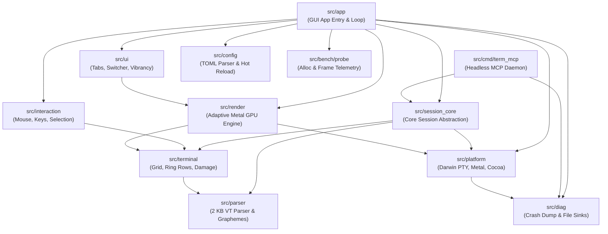

# Term Developer Guide & Systems Architecture Manual

This guide serves as the authoritative technical manual for developers, systems engineers, and contributors working on **Term**. It details the core architectural invariants, repository package layout, Odin language idioms, diagnostic telemetry systems, verification protocols, and contribution workflows governing the codebase.

---

## 1. Architectural Invariants & Guarantees

Term is engineered under strict mechanical sympathy principles. Every contributor must understand and uphold four non-negotiable architectural guarantees:

```
+--------------------------------------------------------------------------------------------------------+
|                                    CORE ARCHITECTURAL GUARANTEES                                       |
+------------------------------------+------------------------------------+------------------------------+
| 1. Steady-State Zero Allocations   | 2. Closed-Loop Dataflow            | 3. Contract Reuse & Parity   |
| Hot loops must never allocate heap | Every mutation traces to a sink    | Verify endpoints and layouts |
+------------------------------------+------------------------------------+------------------------------+
| 4. Zero-Overhead ASCII Fast Path   | 5. O(changes) Work Complexity      | 6. Idle Zero Work            |
| Direct index into cell grid        | Hierarchical damage cell->span->row| 0 CPU / 0 GPU when static    |
+------------------------------------+------------------------------------+------------------------------+
```

### 1.1 Steady-State Zero Allocations
- **Hot-Loop Allocation Prohibition**: Heap allocations (`runtime.alloc`, `make()`, dynamic slice resizing, or string formatting with the default allocator) are **strictly forbidden** inside steady-state hot paths. Hot paths include:
  - Background PTY drain loops (`pty_drain`).
  - VT/ANSI escape sequence parsing (`parse_chunk`).
  - Grid cell mutation and line reflow.
  - Damage accumulation and dirty span coalescing.
  - Render compilation and GPU command buffer encoding.
- **Preallocation Model**: All memory buffers are preallocated during startup or explicit window resize events:
  - **PTY Buffer**: 64 KiB contiguous ring buffer per active terminal session.
  - **Grid Storage**: Single contiguous array of 64-bit `Semantic_Cell` values paired with a parallel slice of `Direct_Color_Channel` records for 24-bit TrueColor.
  - **Extended Grapheme Cluster (EGC) Store**: Preallocated pool of 256 cluster records (16 codepoints per cluster) managed via an inline LIFO free stack.
  - **GPU Glyph Atlas**: 128 KiB R8 texture ($256 \times 512$ pixels) containing exactly 512 fixed slots ($16 \times 16$ pixels).
- **Enforcement**: Memory allocations in steady state are monitored and verified via the `Alloc_Probe` subsystem ([`src/bench/probe/alloc_probe.odin`](file:///Users/dwlhm/project/term/src/bench/probe/alloc_probe.odin)). Any pull request introducing allocations in hot loops will fail continuous integration.

### 1.2 Closed-Loop Dataflow
Every event, state mutation, or output produced anywhere in Term must trace to an active, well-defined terminal sink:
- **PTY Stream Dataflow**: Master PTY bytes $\to$ Drain Buffer $\to$ VT State Machine $\to$ Grid Mutation $\to$ Damage Journal $\to$ Render Compiler $\to$ Metal Command Buffer $\to$ `CAMetalLayer` Presentation.
- **MCP Stream Dataflow**: JSON-RPC request over `os.stdin` $\to$ Stdio Reader $\to$ RPC Router $\to$ Session Core $\to$ Screen/Output Capture $\to$ JSON-RPC response over `os.stdout`.
- **Diagnostics Dataflow**: Assertion failure / panic $\to$ Snapshot capture $\to$ File Sink (`~/.local/share/term/logs/`) $\to$ `os.stderr` flush $\to$ Process termination.
Floating side-effects, unconsumed events, or orphan dataflows are prohibited.

### 1.3 Contract Reuse & Strict Shape Parity
- **No Speculative Duplication**: Before implementing a data structure, parser routine, or platform bridge, search the codebase.
- **Contract Verification**: When interacting with cross-subsystem boundaries (such as `src/session_core` ports or `src/platform` Metal bindings), always inspect the concrete procedure signatures, parameter shapes, and struct alignment.
- **Never Assume Layouts**: Verify data alignment, especially for structures transmitted to GPU vertex buffers or Darwin system calls (`winsize`, `termios`).

---

## 2. Repository Layout & Package Architecture

The codebase is organized into modular packages located in [`src/`](file:///Users/dwlhm/project/term/src/). The diagram below outlines the dependency hierarchy:



### 2.1 Package Manifest

| Package Path | Primary Responsibilities & Key Files |
| :--- | :--- |
| **[`src/app/`](file:///Users/dwlhm/project/term/src/app/)** | macOS GUI entry point (`main.odin`), application state loop (`app.odin`), window management, tab dispatching, and synchronization between UI events and Metal rendering. |
| **[`src/session_core/`](file:///Users/dwlhm/project/term/src/session_core/)** | Unified, headless session engine (`session.odin`, `ports.odin`) shared between GUI tabs and the headless MCP server. Manages background PTY drain threads, command execution, and viewport snapshot extraction. |
| **[`src/cmd/term_mcp/`](file:///Users/dwlhm/project/term/src/cmd/term_mcp/)** | Standalone headless Model Context Protocol daemon over stdio (`main.odin`, `server.odin`). Implements the 7 MECE automation tools for autonomous AI agents. |
| **[`src/terminal/`](file:///Users/dwlhm/project/term/src/terminal/)** | Virtual terminal state: circular ring-buffer rows (`grid.odin`), 64-bit cell layouts (`cell.odin`), 3-tier hierarchical damage tracking (`damage.odin`), cursor states, and tab containers. |
| **[`src/parser/`](file:///Users/dwlhm/project/term/src/parser/)** | Scalar ANSI/VT escape sequence parser (`parser.odin`), 2 KB L1-resident transition table (`table.odin`), CSI/OSC/DCS dispatchers, UTF-8 state decoder, and bounded grapheme cluster storage (`grapheme.odin`). |
| **[`src/render/`](file:///Users/dwlhm/project/term/src/render/)** | Adaptive Metal rendering engine: multi-strategy compiler (`compiler.odin`, `strategy.odin`), 128 KiB R8 texture atlas (`atlas.odin`), asynchronous glyph worker thread, and triple-buffered uniform rings. |
| **[`src/platform/`](file:///Users/dwlhm/project/term/src/platform/)** | Darwin/macOS platform integration: POSIX PTY spawning (`pty.odin`), Metal device and `CAMetalLayer` swapchain (`metal.odin`), Cocoa windowing hooks, clipboard bridging, and system font discovery. |
| **[`src/config/`](file:///Users/dwlhm/project/term/src/config/)** | Declarative configuration parser (`config.odin`), TOML tokenizer, configuration options structs, and asynchronous file system watcher for live reload. |
| **[`src/ui/`](file:///Users/dwlhm/project/term/src/ui/)** | High-level UI composition: tab bar rendering, quick session switcher modal (`switcher.odin`), status overlay, and native Cocoa vibrancy blur (`NSVisualEffectView`). |
| **[`src/interaction/`](file:///Users/dwlhm/project/term/src/interaction/)** | User interaction: mouse selection ranges, keyboard shortcut translation, clickable URL detection, and drag-and-drop file path injection. |
| **[`src/diag/`](file:///Users/dwlhm/project/term/src/diag/)** | Diagnostics and telemetry: assertion failure crash handlers (`crash.odin`), thread-safe file logging (`sink_file.odin`), and snapshot counters (`counters.odin`). |
| **[`src/bench/probe/`](file:///Users/dwlhm/project/term/src/bench/probe/)** | In-process verification probes: `alloc_probe.odin` (verifies zero steady-state heap allocations), `frame_probe.odin` (frame pacing), and `profile_ring.odin` (resize telemetry). |

---

## 3. Odin Coding Conventions & Idioms in Term

Term is written in standard [Odin](https://odin-lang.org) adhering strictly to the `-strict-style` compiler flag.

### 3.1 Explicit Allocators and Memory Arenas
Never rely on implicit hidden heap allocations. Pass explicit allocators or use arenas:

```odin
import "core:mem"

// Preallocate an arena for transient frame operations
frame_arena: mem.Arena
arena_buffer: [64 * mem.Kilobyte]byte
mem.arena_init(&frame_arena, arena_buffer[:])
frame_allocator := mem.arena_allocator(&frame_arena)

// Reset the arena at the start of each frame loop
mem.arena_free_all(&frame_arena)
```

- **`context.temp_allocator`**: Use for temporary strings or short-lived path concatenations within a single procedure.
- **Never Call `make()` in Hot Paths**: Preallocate slices or fixed arrays (`[CAPACITY]T`) during initialization.

### 3.2 Strict Typing & Bit Sets
- Specify fixed integer sizes (`u8`, `u32`, `i32`, `u64`) across all network, file, and GPU-facing data structures.
- Use native Odin `bit_set` for flags instead of manual bit-shifting:

```odin
Cell_Flag :: enum u8 {
    Bold,
    Italic,
    Underline,
    Inverse,
    Direct_Color,
    Wide_Lead,
    Wide_Trail,
}

Cell_Flags :: bit_set[Cell_Flag; u8]
```

### 3.3 Thread Safety and Concurrency
Term uses a multi-threaded architecture with explicit synchronizations:
- **PTY Drain Thread**: Continuously reads from the master PTY and writes into the lock-protected input ring.
- **Glyph Rasterizer Worker**: Pulls misses from a bounded queue and populates the glyph atlas.
- **UI & Render Thread**: Owns the terminal grid and GPU presentation.

Use `core:sync` primitives strictly:

```odin
import "core:sync"

State :: struct {
    mutex: sync.Mutex,
    value: int,
}

update_state :: proc(s: ^State, v: int) {
    sync.mutex_lock(&s.mutex)
    defer sync.mutex_unlock(&s.mutex)
    s.value = v
}
```

For high-throughput telemetry counters, use `sync.atomic_*` procedures to avoid lock contention:

```odin
sync.atomic_add(&probe.frames_rendered, 1)
```

### 3.4 Context and Foreign C / Objective-C FFI Patterns
When binding to macOS system frameworks (Metal, Cocoa, POSIX PTY), define foreign blocks cleanly with the C calling convention:

```odin
foreign import libc "system:c"

@(default_calling_convention="c")
foreign libc {
    openpty :: proc(amaster, aslave: ^i32, name: cstring, termp: rawptr, winp: rawptr) -> i32 ---
}
```

For Objective-C runtime dispatch:

```odin
import "core:sys/darwin/foundation"

// Always resolve selectors once and cache them in static variables
SEL_alloc := foundation.sel_registerName("alloc")
```

---

## 4. Testing & Quality Verification

Term includes comprehensive type checking, unit tests, integration tests, and benchmark suites automated via [`Makefile`](file:///Users/dwlhm/project/term/Makefile).

```
+--------------------------------------------------------------------------------------------------------+
|                                      TESTING & QUALITY PIPELINE                                        |
+--------------------------+------------------------------+----------------------------------------------+
| 1. Type Check            | 2. Unit & Integration Suites | 3. Performance & Agent Verification          |
| make check (12 modules)  | make test (13 core packages) | make test-mcp (11 suites, 103 assertions)    |
| -strict-style verified   | Single-threaded test harness | make bench-run / make bench-video            |
+--------------------------+------------------------------+----------------------------------------------+
```

### 4.1 Type Checking (`make check`)
Before running tests, verify compiler correctness and style compliance across all 12 modules:

```bash
make check
```

This runs `odin check` under `-strict-style` across:
1. `src/app`
2. `src/session_core`
3. `src/cmd/term_mcp`
4. `src/terminal`
5. `src/parser`
6. `src/render`
7. `src/platform`
8. `src/config`
9. `src/ui`
10. `src/interaction`
11. `src/diag`
12. `src/bench/probe`

### 4.2 Unit & Integration Testing (`make test`)
Run the full test suite covering all 13 core packages:

```bash
make test
```

This runs all package tests sequentially with `-define:ODIN_TEST_THREADS=1` to guarantee deterministic state verification:
- `test-config`: TOML configuration parsing and defaults.
- `test-terminal`: Grid circular ring buffers, cell mutations, damage tracking, and resize reflow.
- `test-parser`: ANSI state machine, CSI/OSC escape handling, and UTF-8 decoder.
- `test-pty`: POSIX master/slave PTY lifecycle and non-blocking I/O.
- `test-input`: Keyboard and mouse event translation.
- `test-tabs`: Multi-tab lifecycle, session detachment, and re-attachment.
- `test-ui`: UI rendering and quick switcher fuzzy matching.
- `test-interaction`: Selection models, hyperlink regex parsing, and clipboard.
- `test-render`: Render compiler, style LUT, and atlas packing.
- `test-app`: Application state machine and window event handling.
- `test-bench`: Benchmark harness consistency checks.
- `test-mcp`: Headless JSON-RPC 2.0 protocol and MECE tools.
- `test-diag`: Crash reporter formatting and file sink logging.
- `test-probe`: Allocator and frame pacing telemetry probes.
- `test-session-core`: Core session persistence and observer ports.

### 4.3 MCP Test Suite (`make test-mcp`)
Execute unit tests for the headless Model Context Protocol server:

```bash
make test-mcp
```

### 4.4 Continuous Benchmark Verification
To ensure no performance regressions before releasing:

```bash
# Microbenchmarks (parser, terminal, PTY, input-to-photon latency)
make bench-run

# Continuous full-screen TrueColor 60 FPS stress test
make bench-video

# Autonomous agent comparative benchmark vs Node.js and Python
make bench-mcp
```

---

## 5. Diagnostics & Performance Probes

Term features built-in diagnostics and lightweight telemetry probes for observing production behavior, investigating assertion crashes, and enforcing zero-allocation invariants.

### 5.1 Runtime Diagnostics & Crash Reporting (`src/diag/`)

#### Crash Reporter (`crash.odin`)
Term intercepts runtime panics and assertion failures via `diag_install_crash_handler()`. When an assertion triggers:
1. It queries `diag_get_snapshot()` to capture current terminal telemetry (active strategy, tab count, grid dimensions).
2. It formats a structured diagnostic report with timestamps, file locations, and uptime.
3. It emits the dump directly to `os.stderr` and appends it to the active log file sink before calling the default panic procedure.

```odin
import "src/diag"

// In main entry:
diag.diag_install_crash_handler()

// Throughout the application:
diag.diag_set_snapshot({
    strategy  = "Instance",
    tab_count = len(app.tabs),
    grid_rows = active_grid.rows,
    grid_cols = active_grid.cols,
})
```

#### Persistent File Logging (`sink_file.odin`)
Logs are stored in the user's local application data directory:
$$\sim/\text{.local/share/term/logs/term-YYYYMMDD-HHMMSS.log}$$
The file sink uses thread-safe mutex locking and flushes immediately upon write.

### 5.2 Telemetry Probes (`src/bench/probe/`)

#### Enforcing Steady-State Zero Allocations (`alloc_probe.odin`)
The `Alloc_Probe` wraps an Odin allocator to track dynamic memory usage:

```odin
import "src/bench/probe"

probe: probe.Alloc_Probe
probe.alloc_probe_init(&probe, context.allocator)
wrapped_allocator := probe.alloc_probe_allocator(&probe)

// Perform one-time startup allocations
// ...

// Lock allocator to steady state:
probe.alloc_probe_mark_init_done(&probe)

// Run frame loop
render_frame(wrapped_allocator)

// Verify zero post-init allocations:
alloc_count := probe.alloc_probe_post_init_allocs(&probe)
assert(alloc_count == 0, "Violation: Heap allocation detected in steady-state frame loop!")
```

#### Frame Pacing & Strategy Monitoring (`frame_probe.odin`)
Tracks frame rendering frequency, skipped frames, PTY throughput, and distribution across GPU strategies:

```odin
import "src/bench/probe"

var frame_probe: probe.Frame_Probe
probe.frame_probe_init(&frame_probe)

// In render loop:
probe.frame_probe_record(&frame_probe, rendered = true, strategy_name = "Instance", pty_bytes = 1024)

// Produce formatted telemetry summary:
report := probe.frame_probe_report(&frame_probe)
```

#### Lock-Free Resize Telemetry Ring (`profile_ring.odin`)
During dynamic window resizing, `Profile_Ring` records timing records into a preallocated circular ring buffer ($8,192$ records) without blocking the UI thread. An asynchronous background worker exports metrics to a CSV file defined by `TERM_PROFILE_RESIZE_TELEMETRY_FILE`:

```bash
export TERM_PROFILE_RESIZE_TELEMETRY_FILE="/tmp/resize_telemetry.csv"
./bin/term
```

---

## 6. Contributing Workflow & Conventional Commits

We welcome contributions that adhere to our measure-first engineering principles.

### 6.1 Conventional Commit Format
Commit messages must follow the [Conventional Commits](https://www.conventionalcommits.org) specification:

```
<type>(<scope>): <short description in present tense>

[optional body explaining non-obvious engineering rationale]

[optional footer(s)]
```

#### Allowed Types
- **`feat`**: Introduces a new feature or user-facing capability.
- **`fix`**: Fixes a bug or addresses a defect.
- **`perf`**: Performance optimization (must include empirical benchmark justifications).
- **`docs`**: Documentation updates or architectural specifications.
- **`refactor`**: Code restructuring without behavior or performance change.
- **`test`**: Adding, modifying, or updating test suites.
- **`chore`**: Maintenance, build system changes, or CI updates.

#### Standard Scopes
- `terminal`: Grid, ring buffer, cell storage, damage accounting.
- `parser`: VT state machine, CSI/OSC handlers, UTF-8.
- `render`: GPU compiler, Metal pipeline, texture atlas, shaders.
- `platform`: macOS Darwin PTY, Cocoa windowing, Metal swapchain.
- `session_core`: Core session persistence and observer interfaces.
- `mcp`: Standalone MCP server daemon and tools.
- `config`: Configuration options, TOML parser.
- `ui`: Tabs, quick switcher, status bar.
- `diag`: Telemetry probes, logging, crash handlers.

#### Example Commit Messages
```
perf(render): coalesce dirty spans to reduce metal vertex buffer upload
fix(terminal): preserve cursor column across decstbm scroll margin reset
feat(mcp): implement dynamic terminal resizing tool via tiocswinsz
docs(benchmarks): document simd parser rejection and empirical trade-offs
```

### 6.2 Pull Request Checklist
Before opening a pull request, ensure all gates pass:

1. **Clean Type Check**:
   ```bash
   make check
   ```
   Must complete with zero errors and zero warnings under `-strict-style`.
2. **Comprehensive Test Suite**:
   ```bash
   make test
   make test-mcp
   ```
   All test cases must pass without intermittent failures.
3. **No Steady-State Allocations**:
   Ensure no new heap allocations occur in rendering, parsing, or PTY drain loops.
4. **Empirical Justification**:
   If modifying performance-critical subsystems (`src/parser/`, `src/terminal/`, `src/render/`), run `make bench-run` and include before/after percentile measurements ($p_{50}, p_{95}$) in your pull request description.
